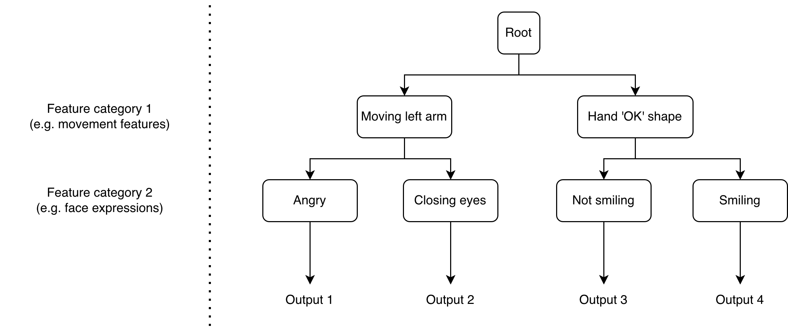

CPAC Project
==============

# 1) Project description

This project is an interactive audiovisual installation designed to create a dynamic and immersive atmosphere that responds to human presence and behavior. A camera quietly watches a visitor; from their facial expression it estimates an emotional state. In response it surfaces a painting from art history whose emotional character resonates with that feeling, drawn from thousands of works in the WikiArt Emotions dataset.

It was envisioned as something that belongs in a gallery or museum: a way to spark a visitor's curiosity and draw their attention toward a specific artwork. The idea is to offer a small emotional journey through art history. 

The user steps in front of the screen, their face is detected and their expression is read live. A painting that echoes their mood appears, accompanied by a generative soundscape whose character matches the painting's artistic style and their emotional valence/arousal. Simple hand gestures let them interact without touching anything. They can swipe to move through paintings and styles, thumbs-up/down to teach it their taste (which it remembers across sessions), and an "OK" sign to enter a mode where their hand stirs the artwork into a cloud of drifting particles. 

Sound is generated in real time using SuperCollider, while Processing is responsible for the visual component. Machine learning models are used for facial expression and hand-gesture recognition. Communication between the different modules is handled through Python and the Open Sound Control (OSC) protocol, ensuring seamless real-time interaction.

By bringing together sound synthesis, visual art, computer vision, and machine learning, everything reacts continuously and the installation feels alive and personal.


# 2) Challenges & Accomplishments & Lessons

The hardest part was making the 4 distinct tools that we used work as a coherent, real time system over OSC. These are computer vision, a PyTorch emotion model, SuperCollider for sound, and Processing for visuals. Designing generative audio that doesn't feel chaotic was another challenge.  Translating the facial emotion into the emotional space of the WikiArt dataset, while staying coherent, was also difficult. 

Accomplishments: A fully working installation where a face and a hand simultaneously drive image selection, a generative soundscape, and reactive visuals live. The sound engine is synthesis-only, and the recommender is able to keep the experience fresh and even remembers a visitor's taste across sessions.

Lessons learned: We learned how to better design a real time multi-stage system. We also learned that continuous signals (like valence/arousal and windowed motion) make an installation feel much more more alive than discrete on/off states, and that a huge share of the success lies in mapping and tuning, not in the models themselves. On the audio side, we saw that the line between generative and random is hard to draw and control but we learned how to use this fine line between them as a deliberate design choice.


# 3) Project technical overview

The sound and visuals are meant to be changed live by the user. To that extent, we use computer sensors to collect data from user's behavior, such as facial expression or movements. The raw signal from those sensors are then interpreted by algorithms or machine learning models, to extract a set of inputs that will then be used by the audiovisual generation block to change the output live. The following figures shows the overall pipeline of the project.


## a) Feature extraction from sensors

Three different types of features are extracted from sensors' raw signals. They are listed in the following table.


| Movement features             | Facial expression features     | Mouse/trackpad features    |
| :------------                 | :-----------                   | :-----------               |
| No movement (default)         | No expression/Neutral (default)| XY position                |
| Moving fingers                | Smile                          | Left/right click           |
| Moving left/right arm         | Angry                          |                            |
| Moving left/right hand        | Eyes closed                    |                            |
| One hand shape: 'OK' sign     | Surprised                      |                            |
| One hand shape: 'V' sign      |                                |                            |
| One hand shape: 'Punch' sign  |                                |                            |
| One hand shape: 'Heart' sign  |                                |                            |
| One hand shape: Thumbs up     |                                |                            |
| One hand shape: Thumbs down   |                                |                            |


For movement features, we use a motion tracking algorithm similar to the one we have seen in CPAC lab, to track arms, hands and fingers movements. Here we can also track the direction of the movement (e.g. moving hand to the right direction triggers different set of audio effects than if it was moved it to the left).

As far as hand shapes are concerned, we will train a Support Vector Machine (SVM) using Python and Scikit-Learn. The training will be carried exactly as in the CPAC lab n°4: *Cognitive Agents* (also described in *Lecture 8 - Cognitive Agents and ML-1*):

- we capture several pictures of the different hand shapes, which are later converted in black and white (background substraction);
- we add the corresponding label to each of them;
- we train the SVM classification model.

For the facial expression recognition we may use a similar pipeline: 
- we use YOLO for face detection (could be fine-tuned using datasets like WIDER FACE),
- train a classification model (e.g. SVM), using *FER-2013* and *AffectNet* datasets
- classify emotions into categories like happy, sad, angry, surprised, neutral, etc.

Finally, mouse/trackpad features are the simplest to extract, as they do not need further processing and can be used as inputs as is.

## b) Feature tree

The main asset of the project is that a different feature-to-audiovisuals mapping is determined every time the project is ran. Therefore, the user never knows the exact consequences of their interactions with the system. This introduces an element of gamification, which may enhance user engagement and could support the project's stress-relief objectives.

In order for the system to be even less predictable, we do not simply consider a matching between features and audiovisuals, but a matching between *combinations* of features and audiovisuals. These combinations are represented by a tree, like the one in the following figure.




So the pipeline may be the following (this is example of Supercollider, for the Processing logic is more or less the same):

| Step | Action |
|------|--------|
| 1 | Tree regenerates randomly at session start |
| 2 | Sensor input arrives continuously |
| 3 | Tree is evaluated |
| 4 | If conditions are met, then ONE leaf fires |
| 5 | OSC: `/scene synth_id param1 param2` |
| 6 | SuperCollider selects synth and plays |
| 7 | On input change, new leaf fires, previous stops |

Each leaf then represented by the following structure: 

```
leaf = {
    "conditions_met": ["moving_left_arm", "angry"],
    "depth": 2,
    "branch_index": 3
}
```


Each output is then mapped and converted to a specific OSC message, which is sent to SuperCollider and Processing for sound and visuals changes.


## c) Visuals generation (Processing)


- particle systems (Boids, steering vectors with the use of the mouse XY position?)
- user's movements perturbates particle trajectories


## c) Sound generation (Supercollider)
- use of attractors (Hénon, Gingerbreadman..) to generade melodies
- possibly generate chords with Marcov chain
- use of samples for real-life atmospheres (city, nature, sea...)
