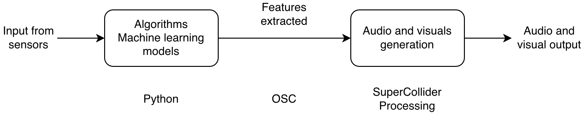

CPAC Project - ParticlArt
==============

# 1) Project description

This project is an interactive audiovisual installation designed to create a dynamic and immersive atmosphere that responds to human presence and behavior. A camera quietly watches a visitor; from their facial expression it estimates an emotional state. In response it surfaces a painting from art history whose emotional character resonates with that feeling, drawn from thousands of works in the WikiArt Emotions dataset.

It was envisioned as something that belongs in a gallery or museum: a way to spark a visitor's curiosity and draw their attention toward a specific artwork. The idea is to offer a small emotional journey through art history. 

The user steps in front of the screen, their face is detected and their expression is read live. A painting that echoes their mood appears, accompanied by a generative soundscape whose character matches the painting's artistic style and their emotional valence/arousal. Simple hand gestures let them interact without touching anything. They can swipe to move through paintings and styles, thumbs-up/down to teach it their taste (which it remembers across sessions), and an "OK" sign to enter a mode where their hand stirs the artwork into a cloud of drifting particles. 

Sound is generated in real time using SuperCollider, while Processing is responsible for the visual component. Machine learning models are used for facial expression and hand-gesture recognition. Communication between the different modules is handled through Python and the Open Sound Control (OSC) protocol, ensuring seamless real-time interaction.

By bringing together sound synthesis, visual art, computer vision, and machine learning, everything reacts continuously and the installation feels alive and personal.

# 2) Challenges & Accomplishments & Lessons

The hardest part was making the 4 distinct tools that we used work as a coherent, real time system over OSC. These are computer vision, a PyTorch emotion model, SuperCollider for sound, and Processing for visuals. Designing generative audio that doesn't feel chaotic was another challenge.  Translating the facial emotion into the emotional space of the WikiArt dataset, while staying coherent, was also difficult. 

Accomplishments: A fully working installation where a face and a hand simultaneously drive image selection, a generative soundscape, and reactive visuals live. The sound engine is synthesis-only, and the recommender is able to keep the experience fresh and even remembers a visitor's taste across sessions.

Lessons learned: We learned how to better design a real time multi-stage system. We also learned that continuous signals (like valence/arousal and windowed motion) make an installation feel much more more alive than discrete on/off states, and that a huge share of the success lies in mapping and tuning, not in the models themselves. On the audio side, we saw that the line between generative and random is hard to draw and control but we learned how to use this fine line between them as a deliberate design choice.

# 3) Technology
- PyTorch (ResNet50 emotion model with valence/arousal)
- OpenCV 
- MediaPipe (hand tracking)
- CLIP / HuggingFace Transformers (visual embeddings)
- NumPy / pandas · WikiArt Emotions dataset
- SuperCollider (real-time generative synthesis)
- Processing + oscP5 (particle-system visuals)
- OSC via python-osc
- Git LFS.
  
Concepts: real-time computer vision, facial emotion recognition, gesture recognition, content-based retrieval and cosine similarity, embedding-based diversity, audio–visual synchronization, generative sound design, particle systems.

# 4) Project technical overview

The installation runs as four cooperating modules that communicate in real time over OSC. The Python program reads the webcam, interprets the visitor with machine-learning models, chooses a matching painting, and sends the resulting signals to the sound engine (SuperCollider) and a visual engine (Processing), which react in real time.

The data flows in four stages:

1. **Sensing** — a webcam frame is captured (`emotion_recognition/camera.py`).
2. **Interpreting** — ML models extract the visitor's facial emotion and hand gestures.
3. **Deciding** — the emotion drives selection of an emotionally matching painting (`painting_selector/`).
4. **Expressing** — all signals are sent over OSC to SuperCollider and Processing.

## a) Feature extraction from sensors

All input comes from a single webcam, and two machine-learning pipelines run on each frame.

**Facial emotion.** The largest ("primary") face in the frame is located with OpenCV, cropped, and passed to a ResNet50-based model (`emotion_recognition/checkpoints/best_model.pth`, trained on FER-2013-style data with `train.py`). It outputs a 7-class emotion probability distribution together with a continuous *valence* (negative↔positive) and *arousal* (calm↔excited) estimate.

**Hand gestures.** Google MediaPipe's Hand Landmarker returns 21 hand landmarks, from which lightweight geometric rules derive both discrete gestures and continuous control signals. No separate model training is required.

The features extracted are:

| Facial emotion (7-class) | Static hand shapes | Dynamic hand motions | Continuous signals |
| :--- | :--- | :--- | :--- |
| angry, disgust, fear, happy, neutral, sad, surprise | open, fist, thumbs up, thumbs down, OK, point, peace | swipe left / right / up / down, wave, push | valence, arousal, palm X/Y, hand size (distance), pinch, spread, wrist angle, windowed size-delta |

## b) Mapping features to output

**Emotion → painting (`painting_selector/selector.py`).** The facial emotion probabilities, averaged over a short window, are mapped into WikiArt's 20-dimensional emotion space. Paintings are then ranked by cosine similarity to that vector, weighted by each work's average art rating and by the visitor's personal score. The system avoids paintings that look too similar to recent ones or repeat the same style, and it adds a touch of randomness when picking from the best matches. Visual similarity uses CLIP image embeddings.

**Signals → sound (OSC → SuperCollider).** The current painting's artistic style selects one of five soundscapes (classical, expressionist, abstract, impressionist, pop). Valence shifts major/minor tonality, arousal drives tempo, density and amplitude; palm position and hand distance modulate pan, filter and reverb; and in particle mode a fast hand push or retreat triggers synchronized glass break/regroup sounds.

**Signals → visuals (OSC → Processing).** The current painting is rebuilt as a field of colored particles that flow along the image's brightness gradient; palm movement pushes the particles, hand distance zooms, arousal sets the flow speed, and the same windowed push/retreat signal used by the sound scatters or magnetizes the particles. So image and audio move as one.

**Learning the visitor's taste.** A thumbs-up or thumbs-down adjusts a persistent per-painting score that biases future selection. It is saved between sessions and can be reset live (the `R` key). The OK sign is reserved for toggling particle mode and no longer affects taste.

## c) Visuals generation (Processing)
`painting_visualizer/painting_visualizer.pde` turns the selected painting into a particle system: each particle is seeded from a painting pixel and steered by the painting's brightness-gradient field plus Perlin noise turbulence. An OK gesture toggles a particle follow mode in which the hand pushes, scatters, and regroups the particles. A subtle brownian jitter keeps the image alive even when no one is interacting. The sketch also renders the artwork itself and lets it slowly dissolve into its own particles.

## d) Sound generation (SuperCollider)
`audio_playback/SC_mood_reactive.scd` (with `calm_synthdefs.scd`) is a fully synthesis based sound engine. Each of the five soundscapes has its traits, chosen by painting style and continuously shaped by valence and arousal. A palm-driven voice tracks the hand, gesture accents and everything crossfades smoothly as paintings and moods change.

# 5) Students: the members of the group with a sentence that explains for each person what was their main contribution to the project 

Onur Arıkan — ...

Thomas Guffroy  — ...

Margarita Makurina — ...

Umut Özer — ...

